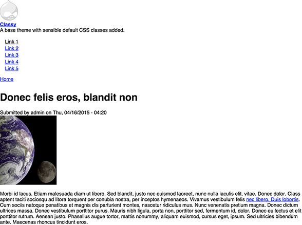

# Parity

Parity is a Drupal 8 HCPSS theme, meant to provide a base for HCPSS websites
and applications.



## Development

To develop the theme, you need npm, bower, and grunt. There is a convenient
docker container that can help:

```
docker run --rm -v $(pwd):/data banderson/node-bower-gulp npm install
docker run --rm -it --name watchme -v $(pwd):/data banderson/node-bower-gulp gulp watch
```
